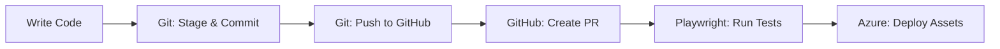
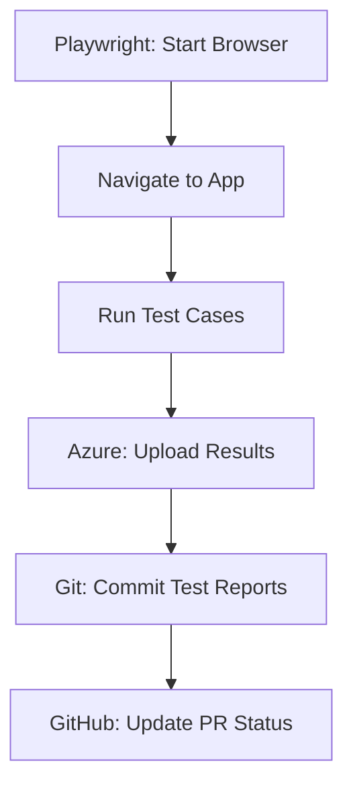

# MCP Servers Configuration Summary

This document provides a complete overview of all MCP (Model Context Protocol) Servers configured for the HRMS project.

## Overview

The HRMS project has **three MCP servers** configured to enable AI assistants to interact with various services:

1. **Playwright MCP Server** - Browser automation and E2E testing
2. **Azure MCP Server** - Azure cloud services integration
3. **Git/GitHub MCP Server** - Version control and GitHub operations

## Configuration Location

All MCP servers are configured in: `.vscode/mcp-settings.json`

```json
{
  "mcpServers": {
    "playwright": { ... },
    "azure": { ... },
    "github": { ... },
    "git": { ... }
  }
}
```

## 1. Playwright MCP Server

### Purpose
Browser automation for end-to-end testing and web scraping.

### Configuration
```json
{
  "command": "npx",
  "args": ["-y", "@modelcontextprotocol/server-playwright"],
  "env": {
    "PLAYWRIGHT_BROWSER": "chromium"
  }
}
```

### Capabilities
- Navigate to URLs
- Click elements
- Fill forms
- Take screenshots
- Run automated tests
- Capture browser console logs
- Network request monitoring

### Documentation
See: [PLAYWRIGHT-MCP-SETUP.md](PLAYWRIGHT-MCP-SETUP.md)

### Quick Start
```bash
cd hrms-frontend
npm run test:e2e
npm run test:e2e:ui
```

---

## 2. Azure MCP Server

### Purpose
Integration with Azure cloud services including Blob Storage, Azure AD, and Microsoft Graph API.

### Configuration
```json
{
  "command": "node",
  "args": [".vscode/azure-mcp-server.js"],
  "env": {
    "AZURE_TENANT_ID": "273f45e0-e235-4dde-ab7a-fd3e631a88e0",
    "AZURE_CLIENT_ID": "6ed43a0e-0860-4f9e-9410-459795ff6c03",
    "AZURE_STORAGE_ACCOUNT": "hrmsteststorage77",
    "AZURE_STORAGE_CONTAINER": "hrms-documents"
  }
}
```

### Capabilities
- **Azure Blob Storage**
  - Upload files
  - Download files
  - List files
  - Delete files
- **Azure AD Authentication**
  - Validate tokens
  - User management
- **Microsoft Graph API**
  - User queries
  - Organization data

### Tools Available
1. `azure-blob-upload` - Upload files to blob storage
2. `azure-blob-download` - Download files from blob storage
3. `azure-blob-list` - List files in container
4. `azure-blob-delete` - Delete files from storage
5. `azure-auth-validate` - Validate Azure AD tokens

### Documentation
See: [AZURE-MCP-SETUP.md](AZURE-MCP-SETUP.md)

### Quick Start
```typescript
import { useAzureBlob } from '@/composables/useAzureBlob';

const { uploadFile } = useAzureBlob();
await uploadFile(file, 'documents');
```

---

## 3. Git MCP Server (Local)

### Purpose
Local Git operations for version control.

### Configuration
```json
{
  "command": "node",
  "args": [".vscode/git-mcp-server.js"],
  "env": {
    "GIT_REPO_PATH": "C:\\wamp64\\www\\Converted-HRMS"
  }
}
```

### Capabilities
- Status and log viewing
- Branch management
- Staging and committing
- Push/pull operations
- Stash management
- Diff viewing
- Commit details

### Tools Available
1. `git-status` - Get repository status
2. `git-log` - View commit history
3. `git-diff` - View changes
4. `git-branch-list` - List branches
5. `git-branch-create` - Create new branch
6. `git-branch-switch` - Switch branches
7. `git-add` - Stage files
8. `git-commit` - Commit changes
9. `git-push` - Push to remote
10. `git-pull` - Pull from remote
11. `git-stash` - Stash changes
12. `git-show` - Show commit details

### Documentation
See: [GIT-GITHUB-MCP-SETUP.md](GIT-GITHUB-MCP-SETUP.md)

### Quick Test
```bash
echo '{"method":"tools/list","params":{}}' | node .vscode/git-mcp-server.js
```

---

## 4. GitHub MCP Server (Remote)

### Purpose
GitHub API integration for repository management and collaboration.

### Configuration
```json
{
  "command": "npx",
  "args": ["-y", "@modelcontextprotocol/server-github"],
  "env": {
    "GITHUB_PERSONAL_ACCESS_TOKEN": ""
  }
}
```

### Setup Required
⚠️ **Requires GitHub Personal Access Token (PAT)**

1. Generate PAT at: https://github.com/settings/tokens
2. Required scopes:
   - `repo` - Full repository access
   - `workflow` - GitHub Actions
   - `read:org` - Organization access
   - `read:user` - User profile
   - `user:email` - Email access

3. Configure token:
   ```powershell
   $env:GITHUB_PERSONAL_ACCESS_TOKEN = "ghp_your_token_here"
   ```

### Capabilities
- Repository operations
- Pull request management
- Issue tracking
- GitHub Actions
- Code search
- Collaboration features

### Documentation
- Main: [GIT-GITHUB-MCP-SETUP.md](GIT-GITHUB-MCP-SETUP.md)
- Token Setup: [.vscode/GITHUB-TOKEN-SETUP.md](.vscode/GITHUB-TOKEN-SETUP.md)

---

## Usage Workflow

### Development Workflow



### Testing Workflow



---

## Environment Variables

### Required Environment Variables

#### Frontend (.env)
```env
# Azure AD
VITE_AZURE_CLIENT_ID=6ed43a0e-0860-4f9e-9410-459795ff6c03
VITE_AZURE_AUTHORITY=https://login.microsoftonline.com/273f45e0-e235-4dde-ab7a-fd3e631a88e0
VITE_AZURE_REDIRECT_URI=http://localhost:5173/

# Azure Blob Storage
VITE_AZURE_STORAGE_ACCOUNT=hrmsteststorage77
VITE_AZURE_STORAGE_CONTAINER=hrms-documents
```

#### Backend (.env)
```env
# Azure AD
AZURE_CLIENT_ID=6ed43a0e-0860-4f9e-9410-459795ff6c03
AZURE_CLIENT_SECRET=<your-secret>
AZURE_TENANT_ID=273f45e0-e235-4dde-ab7a-fd3e631a88e0

# Azure Blob Storage
AZURE_STORAGE_ACCOUNT_NAME=hrmsteststorage77
AZURE_STORAGE_ACCOUNT_KEY=<your-key>
AZURE_STORAGE_CONTAINER=hrms-documents
```

#### System Environment (PowerShell)
```powershell
# GitHub PAT
$env:GITHUB_PERSONAL_ACCESS_TOKEN = "ghp_your_token_here"
```

---

## Security Considerations

### ✅ Do's
- Use environment variables for secrets
- Rotate tokens regularly (every 90 days)
- Use minimal required scopes
- Enable 2FA on GitHub
- Use `.gitignore` properly
- Review commits before pushing

### ❌ Don'ts
- Never commit `.env` files
- Never commit access tokens
- Never share PATs publicly
- Don't hardcode credentials
- Don't use overly permissive scopes

---

## Troubleshooting

### Common Issues

#### Playwright Issues
```bash
# Reinstall browsers
cd hrms-frontend
npx playwright install chromium
```

#### Azure Issues
```bash
# Test Azure connection
node .vscode/azure-mcp-server.js
```

#### Git Issues
```bash
# Check Git config
git config --list
git remote -v
```

#### GitHub Issues
```bash
# Verify PAT
curl -H "Authorization: token $env:GITHUB_PERSONAL_ACCESS_TOKEN" https://api.github.com/user
```

---

## Testing MCP Servers

### Test Playwright MCP
```bash
cd hrms-frontend
npm run test:e2e:ui
```

### Test Azure MCP
```bash
echo '{"method":"tools/list","params":{}}' | node .vscode/azure-mcp-server.js
```

### Test Git MCP
```bash
echo '{"method":"tools/list","params":{}}' | node .vscode/git-mcp-server.js
```

### Test GitHub MCP
Requires PAT to be configured first.

---

## Integration Examples

### Example 1: Complete Feature Development

```bash
# 1. Create feature branch (Git MCP)
git checkout -b feature/document-upload

# 2. Write code with Azure Blob integration
# Use useAzureBlob composable

# 3. Write E2E tests (Playwright MCP)
# Add tests in tests/e2e/

# 4. Run tests
npm run test:e2e

# 5. Commit and push (Git MCP)
git add .
git commit -m "feat: add document upload with Azure Blob Storage"
git push origin feature/document-upload

# 6. Create PR (GitHub MCP)
# Use GitHub API or web interface
```

### Example 2: Bug Fix Workflow

```bash
# 1. Create bugfix branch
git checkout -b bugfix/login-error

# 2. Fix the issue
# Make code changes

# 3. Test with Playwright
npm run test:e2e

# 4. Upload test evidence to Azure
# Test results automatically uploaded

# 5. Commit and push
git add .
git commit -m "fix: resolve login authentication error"
git push origin bugfix/login-error

# 6. Create PR and link issue
# Use GitHub MCP or web interface
```

---

## Monitoring and Logs

### Playwright Logs
- Location: `hrms-frontend/playwright-report/`
- View: `npm run test:e2e:report`

### Azure Logs
- Portal: https://portal.azure.com
- Storage Logs: Check storage account metrics
- AD Logs: Azure AD sign-in logs

### Git Logs
```bash
git log --oneline -10
git status
```

### GitHub Logs
- Actions: https://github.com/rohitjain-pio/Converted-HRMS/actions
- Events: Repository insights

---

## Performance Optimization

### Playwright
- Run tests in parallel: `workers: 4`
- Use selective testing
- Implement test sharding

### Azure
- Use CDN for blob storage
- Implement caching
- Optimize blob lifecycle

### Git/GitHub
- Use shallow clones
- Implement LFS for large files
- Optimize CI/CD pipelines

---

## Future Enhancements

### Planned MCP Servers
1. **Database MCP** - Direct database operations
2. **Slack MCP** - Team notifications
3. **Jira MCP** - Project management integration
4. **Monitoring MCP** - Application monitoring

### Planned Features
1. Advanced CI/CD pipelines
2. Automated code review
3. Performance monitoring
4. Security scanning
5. Automated deployments

---

## Resources

### Documentation
- [Playwright MCP Setup](PLAYWRIGHT-MCP-SETUP.md)
- [Azure MCP Setup](AZURE-MCP-SETUP.md)
- [Git/GitHub MCP Setup](GIT-GITHUB-MCP-SETUP.md)
- [Project README](README.md)

### External Links
- [Model Context Protocol](https://modelcontextprotocol.io)
- [Playwright Docs](https://playwright.dev)
- [Azure Docs](https://docs.microsoft.com/azure)
- [Git Docs](https://git-scm.com/doc)
- [GitHub API](https://docs.github.com/en/rest)

---

## Support

For questions or issues with MCP servers:
1. Check documentation above
2. Review troubleshooting section
3. Check GitHub issues
4. Contact: rohit.jain@programmers.io

---

**Last Updated**: November 10, 2025  
**Version**: 1.0.0  
**Status**: ✅ All MCP servers configured and operational
